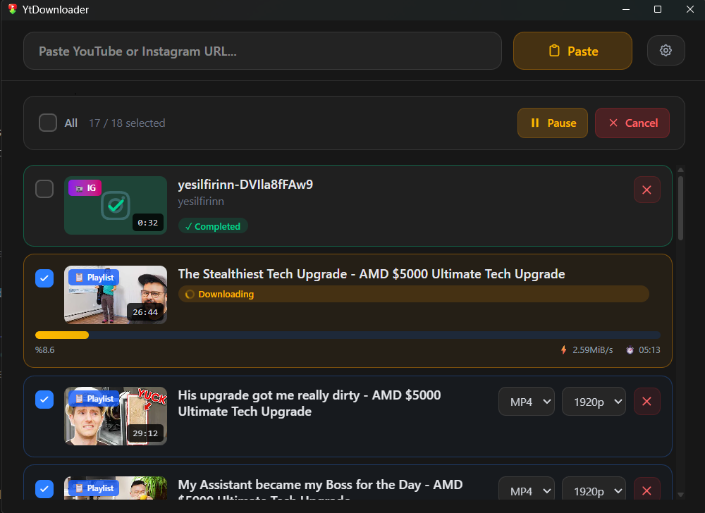

# YtDownloader

**Tauri**, **React** ve **Python** ile oluşturulmuş modern, hızlı ve kullanıcı dostu bir YouTube ve Instagram video indirme uygulaması.


## 🚀 Temel Özellikler

- **Çoklu Platform Desteği**: **YouTube** ve **Instagram**'dan videoları, Shortsları ve tüm oynatma listelerini kolayca indirin.
- **Kuyruk Yönetimi**: Listenize birden fazla video ekleyin ve bunları dinamik olarak yönetin.
- **Akıllı Organizasyon**: İndirilen videoları yükleyicinin adına göre otomatik olarak alt klasörlere ayırır.
- **Format ve Çözünürlük Seçimi**: 144p'den 4K'ya kadar ihtiyacınız olan en iyi kaliteyi seçin.
- **Modern Arayüz**: En iyi kullanıcı deneyimi için tasarlanmış, özel tooltip detaylarına sahip şık ve duyarlı arayüz.
- **Çoklu Dil Desteği**: Tamamen **İngilizce** ve **Türkçe** dillerine çevrilmiştir.
- **Platformlar Arası**: Yüksek performans ve yerel uygulama hissiyatı için Tauri üzerine inşa edilmiştir.

## 🛠️ Teknoloji Yığını

- **Frontend**: React, Vite, TypeScript, Tailwind CSS
- **Backend/Masaüstü**: Tauri (Rust tabanlı köprü)
- **Mantık Katmanı**: Python (güçlü medya işleme için sidecar olarak entegre edilmiştir)

## 📦 Kurulum ve Çalıştırma

### 🔽 İndir ve Kullan
Herhangi bir kurulum yapmadan hızlıca başlamak için:
1. [Releases](https://github.com/aytackayin/YtDownloader/releases) sayfasından en son yükleyiciyi indirin.
2. Yükleyiciyi çalıştırın ve ekrandaki talimatları izleyin.
3. **YtDownloader**'ı başlatın ve indirmeye başlayın!

### 🛠️ Geliştirici Kurulumu (Kaynaktan Derleme)
Projeyi yerelinizde çalıştırmak veya kendi sürümünüzü oluşturmak isterseniz:

**Gereksinimler:**
- [Node.js](https://nodejs.org/)
- [Rust](https://www.rust-lang.org/)
- [Python 3.10+](https://www.python.org/downloads/)

**Kurulum Adımları:**
1. **Depoyu klonlayın:**
   ```bash
   git clone https://github.com/aytackayin/YtDownloader.git
   cd YtDownloader
   ```
2. **Bağımlılıkları yükleyin:**
   ```bash
   npm install
   ```
3. **Python Kurulumu (Sidecar mantığı için):**
   ```bash
   pip install -r src-tauri/python/requirements.txt
   ```
4. **Geliştirme Modunda Çalıştırın:**
   ```bash
   npm run tauri dev
   ```
5. **Üretim Sürümü Oluşturun:**
   ```bash
   npm run tauri build
   ```

## 📸 Ekran Görüntüleri



### 🔐 SHA256 Doğrulama (Checksum)
İndirilen dosyaların bütünlüğünü aşağıdaki SHA256 kodlarını kullanarak doğrulayabilirsiniz:

| Dosya | SHA256 Doğrulama Kodu (Hash) |
| :--- | :--- |
| **ytdownloader.exe** | `213b0eabc4efa6a248083a5cb9a7f16391714b26c48ba276e7838bd58e5f9fa5` |
| **YtDownloader_1.0.0_x64-setup.exe** | `bd0c5777e124aa17a70448495d237f761883b21b387a2be66e6a26a461b1dd6c` |
| **YtDownloader_1.0.0_x64_en-US.msi** | `1329eab320be38043f053e33b6c46ea6044d9eeea720d5df89417ae2816393d7` |

## 🔒 Güvenlik Şeffaflığı (VirusTotal Taraması)

Şeffaflığı ve kullanıcı güvenini sağlamak için, dağıtılan tüm dosyalar VirusTotal kullanılarak herkese açık bir şekilde taranmıştır.

Kullanıcılar, aşağıdaki bağlantıları ve SHA-256 kodlarını kullanarak her bir yayın dosyasını bağımsız olarak doğrulayabilirler.

---

### 📦 Yayın Dosyaları Tarama Sonuçları

#### 🖥️ Taşınabilir Sürüm (Portable)

**Dosya:** `ytdownloader.exe`  
**VirusTotal Raporu:**  
https://www.virustotal.com/gui/file/213b0eabc4efa6a248083a5cb9a7f16391714b26c48ba276e7838bd58e5f9fa5?nocache=1  

**SHA-256:** 213b0eabc4efa6a248083a5cb9a7f16391714b26c48ba276e7838bd58e5f9fa5

---

#### 📦 MSI Yükleyici

**Dosya:** `YtDownloader_1.0.0_x64_en-US.msi`  
**VirusTotal Raporu:**  
https://www.virustotal.com/gui/file/1329eab320be38043f053e33b6c46ea6044d9eeea720d5df89417ae2816393d7?nocache=1  

**SHA-256:** 1329eab320be38043f053e33b6c46ea6044d9eeea720d5df89417ae2816393d7

---

#### ⚙️ Kurulum Dosyası (Setup EXE)

**Dosya:** `YtDownloader_1.0.0_x64-setup.exe`  
**VirusTotal Raporu:**  
https://www.virustotal.com/gui/file/bd0c5777e124aa17a70448495d237f761883b21b387a2be66e6a26a461b1dd6c?nocache=1  

**SHA-256:** bd0c5777e124aa17a70448495d237f761883b21b387a2be66e6a26a461b1dd6c

---

### 🛡️ Doğrulama Bildirimi

Tüm dosyalar doğrudan bu depoda bulunan açık kaynak kodlarından derlenmiştir.

Herhangi bir antivirüs yazılımı uyarı verirse, kullanıcıların şunları yapması önerilir:

- Yukarıda listelenen dosya doğrulama kodlarını (hash) kontrol edin
- VirusTotal çoklu motor tarama sonuçlarını inceleyin
- Tam doğrulama için projeyi kaynak kodundan kendiniz derleyin

Güvenlik ve şeffaflık bu projenin öncelikleridir.

## 🤝 Katkıda Bulunma

Katkılarınız bekliyoruz! Bir sorun (issue) açmaktan veya bir çekme isteği (pull request) göndermekten çekinmeyin.

## 📄 Lisans

Bu proje MIT Lisansı ile lisanslanmıştır.

---
**Aytaç KAYIN** tarafından geliştirilmiştir.
